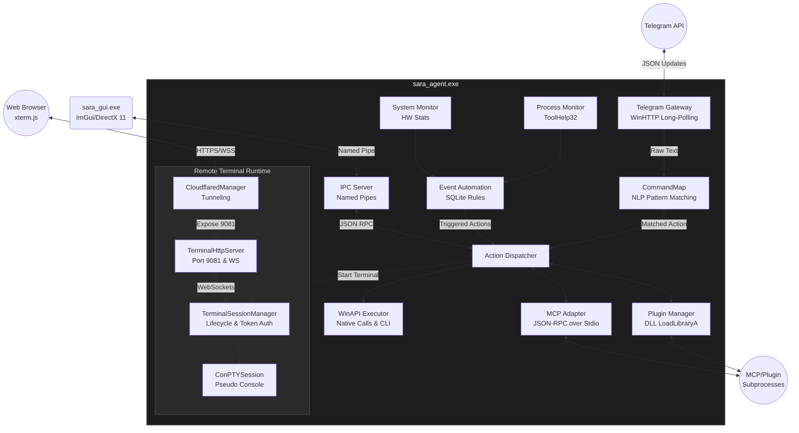

# SARA — System Runtime Autonomous Agent

**SARA** is a native Windows remote runtime and autonomous agent that provides full PC control via Telegram, a web-based terminal, desktop GUI, and extensible plugin system. Written in C++20, compiled with MinGW GCC.

## Architecture Overview



## Components

### sara_agent.exe (Core Agent)
The main executable that runs as Administrator. Connects to Telegram, executes commands, manages the terminal server, and coordinates all subsystems.

- **Telegram Gateway** — Operates a non-blocking `poll_loop` using `WinHTTP` to fetch updates from the Telegram Bot API. It dispatches JSON payloads to `MessageHandler` callbacks and bridges interactions seamlessly to a Local Area Network WebSocket broadcaster.
- **Action Dispatcher & CommandMap** — Provides multi-tiered NLP processing. The `CommandMap` singleton routes natural language phrases via Exact, Prefix, Regex, and Contains matchers, normalizing text and capturing parameters to return standard `MatchResult` objects.
- **WinAPI Executor** — The core execution engine directly interfacing with the Windows Subsystem. Handles application launching via `ShellExecuteA`, keystroke synthesis via `SendInput`, audio control via `IMMDeviceEnumerator`, and pipes CLI execution outputs from `cmd.exe`.
- **System & Process Monitor** — `ProcessMonitor` captures `ToolHelp32` snapshots every 500ms to diff PIDs against known states, while `SystemMonitor` synchronously measures CPU, RAM, and GPU usage without maintaining state.
- **Event Automation** — A SQLite-backed rule engine evaluating triggers (like `cpu_high` or `process_start`) and executing arrays of WinAPI actions sequentially upon state transitions.
- **IPC Server** — Runs a `listen_loop` thread for Inter-Process Communication via Windows Named Pipes (`\\.\pipe\sara_agent`). Parses incoming `IPCMessage` JSON payloads and dispatches them safely.

### Remote Terminal Runtime
A full Windows terminal accessible via any browser securely over the internet:

- **ConPTYSession** — C++ wrapper mapping browser I/O to the native Windows Pseudo Console (`CreatePseudoConsole`). It spawns elevated `cmd.exe` or `powershell.exe` instances and loops a background thread to read raw stdout bytes.
- **TerminalHttpServer** — A custom multi-threaded Winsock TCP server on port 9081. It serves the `xterm.js` frontend and upgrades validated clients to WebSockets to stream raw shell bytes. It also acts as a reverse proxy for the file browser subsystem.
- **TerminalSessionManager** — Thread-safe lifecycle singleton. Manages session expiry, PTY resizing, and safely buffers up to 1MB of ConPTY stdout in `pending_output` before a browser WebSocket attaches.
- **CloudflaredManager** — Automatically provisions a `cloudflared tunnel` child process, dynamically reading `stderr` to extract the live `trycloudflare.com` URL and broadcasting it via Telegram.
- **Token Auth** — Generates cryptographically secure 64-char hex tokens using `BCryptGenRandom`, intercepting requests globally to enforce a zero-trust model for the web interface.

### Extensibility & UI Integrations
SARA supports extensive out-of-process scaling and external modules.

- **sara_gui.exe** — An ImGui + DirectX 11 IPC client that connects to the core agent's named pipe. Serializes interface commands and parses 16KB JSON chunks to render system telemetry and controls.
- **PluginManager (DLLs)** — Dynamically loads external C++ plugins using `LoadLibraryA`. Plugins expose a `create_plugin()` export for the `IPlugin` interface, allowing hot-swappable tools via the agent's mapping system.
- **MCP Adapter (Model Context Protocol)** — Loads JSON-RPC 2.0 servers. It uses `CreateProcess` to launch AI or tool sub-processes, redirecting `stdin` and `stdout` to dispatch `tools/call` requests asynchronously using C++ `std::promise`.

### Deep-Dive Documentation
For more detailed information, please explore the deep-dive architectural documents in the `docs/` directory:
- [Core Agent Architecture](file:///C:/Users/utkarsh_kumar/Desktop/sara/docs/core_agent.md)
- [Remote Terminal Subsystem](file:///C:/Users/utkarsh_kumar/Desktop/sara/docs/terminal.md)
- [Workspace IDE Vision](file:///C:/Users/utkarsh_kumar/Desktop/sara/docs/workspace.md)
- [MeshCentral Remote Desktop](file:///C:/Users/utkarsh_kumar/Desktop/sara/docs/remotedesktop.md)
- [Plugins & MCP Architecture](file:///C:/Users/utkarsh_kumar/Desktop/sara/docs/plugins_and_mcp.md)
- [Desktop GUI Panel](file:///C:/Users/utkarsh_kumar/Desktop/sara/docs/sara_gui.md)
- [Search Plugin](file:///C:/Users/utkarsh_kumar/Desktop/sara/docs/search_plugin.md)

## Directory Structure

```
sara/
├── bot/                    # Start/restart/kill batch scripts
├── build/                  # CMake+Ninja build output
├── data/                   # Runtime data (SQLite DB, trusted users, screenshots)
├── docs/                   # Deep-dive architectural documentation
├── logs/                   # Runtime log files
├── plugins/
│   ├── plugin_api.h        # DLL plugin interface
│   └── spotify/            # Spotify plugin (compiled-in)
├── remote_runtime/         # Terminal subsystem
│   ├── include/            # Headers (ConPTY, HTTP server, sessions, tokens, cloudflare)
│   └── src/                # Implementation
├── runtime/                # Runtime directory (cloudflared.exe)
├── sara_agent/             # Main agent source
│   ├── include/            # 32 header files
│   └── src/                # 33 source files + MCP adapter
├── sara_gui/               # GUI control panel
├── settings/               # Config files (command_map.json, mcp_servers.json)
├── shared/                 # Third-party libs (imgui, json.hpp, sqlite3)
├── CMakeLists.txt          # Root build file
├── settings.json           # Global configuration
└── terminal.md             # Terminal subsystem architecture spec
```

## Build Instructions

### Prerequisites
- MSYS2 UCRT64 with MinGW GCC (C++20 support)
- CMake 3.20+
- Ninja build system

### Build
```bash
cd sara/build
cmake -G Ninja -DCMAKE_BUILD_TYPE=Release ..
ninja
```

This produces:
- `sara/build/sara_agent.exe` — The main agent (requires Administrator)
- `sara/build/sara_gui.exe` — Desktop GUI control panel

### Quick Compile Check
```bash
compile_check.bat
```

## Configuration

### settings.json (root)
```json
{
  "telegram": {
    "token": "<bot_token>",
    "password": "<session_password>",
    "polling_interval_ms": 2000,
    "allowed_user_ids": []
  },
  "terminal_port": 9081,
  "terminal_shell": "powershell.exe",
  "terminal_expiry_minutes": 120,
  "cloudflare_enabled": true,
  "cloudflare_mode": "quick"
}
```

### Other Configuration
- `settings/command_map.json` — Natural language command definitions (700+ commands)
- `settings/mcp_servers.json` — MCP tool server definitions
- `settings/plugins.json` — Plugin configuration
- `settings/cmd_help.json` — Windows CLI help reference

## Security Model

1. **Two-Factor Auth** — Root password (shown on host) + session password from config
2. **Rate Limiting** — 5 messages/second per user
3. **Trusted Users** — Persistent whitelist in `data/trusted_users.json`
4. **Token Security** — `BCryptGenRandom` for terminal session tokens
5. **UAC** — Agent runs as Administrator (manifest embedded in exe)
6. **Session Expiry** — Terminals auto-expire (configurable, default 120 min)

## Usage

### Telegram Commands
| Command | Description |
|---------|-------------|
| `/terminal` | Create a new terminal session (get browser link) |
| `/terminal admin` | Create an elevated (Admin) terminal session |
| `/killterminal` | Destroy a terminal session |
| `/terminals` | List active terminal sessions |
| `/cmd <command>` | Run a Windows CLI command |
| `/status` | System status overview |
| `/monitor` | Real-time system resource monitor |
| `/screenshot` | Capture desktop screenshot |
| `/photo` | Capture webcam photo |
| `/tasks` | List scheduled tasks |
| `/rules` | List event automation rules |
| `/sararestart` | Restart the SARA agent |
| `/sarashutdown` | Shutdown SARA |

Natural language commands (via CommandMap): "play music", "open calculator", "search google for...", etc.

### Bot Scripts
```
bot\start_sara.bat      — Launch sara_agent.exe
bot\kill_sara.bat       — Kill cloudflared + sara_agent
bot\sara_restart.bat    — Restart both processes
```

## Mobile Terminal App

A React Native (Expo) companion app is available at `sara-terminal-app/` — provides a native mobile WebView terminal with tab support, theme selection, font sizing, and command bar. See its own README for details.

## Platform

- **Target:** Windows (10/11)
- **Compiler:** MinGW GCC (MSYS2 UCRT64)
- **Language:** C++20
- **Build:** CMake + Ninja
- **GUI:** DirectX 11 + ImGui
- **SQL:** SQLite (amalgamation)
