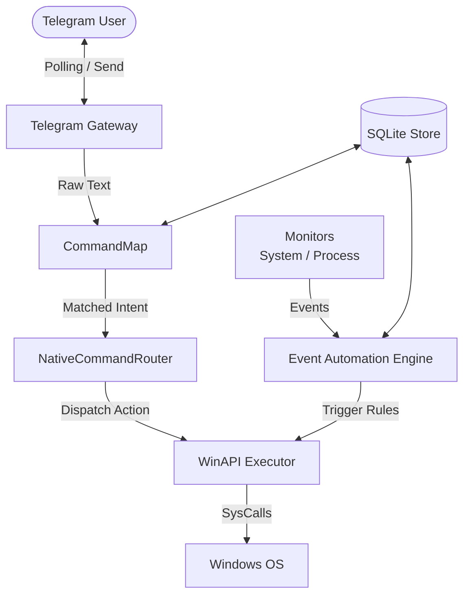
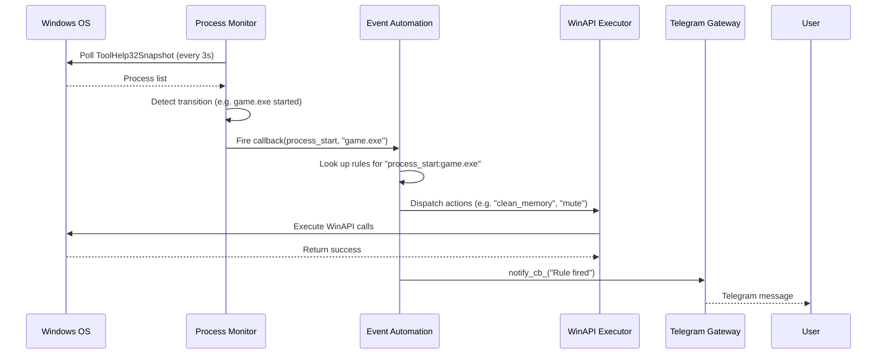

# SARA Core Agent Architecture

This document provides a deep-dive analysis of the core components powering the SARA (System Automation and Response Assistant) C++ Agent.

## 1. Overview
The SARA agent is a lightweight, natively compiled C++ daemon that orchestrates automation and remote control of a Windows machine. It uses Telegram as a natural-language frontend and executes commands via the native Windows API. The agent features background monitoring for automated "If This Then That" (IFTTT) workflows and utilizes a simple intent-matching engine to bypass heavy NLP dependencies.

## 2. Component Breakdown

The architecture is divided into the following primary components:

*   **Telegram Gateway**: Communication layer for receiving commands and sending alerts.
*   **CommandMap**: Lightweight intent mapping engine.
*   **WinAPI Executor**: The execution engine that translates actions into Windows system calls.
*   **System & Process Monitors**: Background observers that track system health and application states.
*   **Event Automation Engine**: The rule engine for defining and triggering background workflows.

## 3. Architecture Diagrams

### High-Level Flow

### Event Automation Sequence

## 4. Detailed Implementation

### Telegram Gateway
**Files**: `TelegramGateway.h`, `TelegramGateway.cpp`

The Telegram Gateway is a lightweight C++ wrapper around the Telegram Bot API. 
*   **Mechanism**: Uses long polling in a dedicated background thread (`poll_loop`). It repeatedly calls the `/getUpdates` endpoint.
*   **Processing**: Uses `nlohmann::json` to parse incoming HTTP responses. Extracted messages are structured into a `TelegramMessage` object and queued.
*   **Features**: Includes rich methods for sending inline keyboards (`send_inline_keyboard`), answering callbacks (`answer_callback_query`), downloading files, and sending chunked logs. 
*   **Integration**: Routes incoming text out to the main agent via a generic `MessageHandler` callback.

### CommandMap
**Files**: `CommandMap.h`, `CommandMap.cpp`

A custom, NLP-less text matching engine optimized for speed and simplicity.
*   **Mechanism**: Loads mapping definitions from JSON files (e.g., mapping "open spotify" to the action `open_app` with parameter `{"target": "spotify"}`).
*   **Matching Strategies**: Supports 4 match types for flexibility:
    1.  `exact`: Direct string match (fastest, map lookup).
    2.  `prefix`: Matches the beginning of the string (useful for "search [query]").
    3.  `contains`: Substring match.
    4.  `regex`: Standard C++ regular expressions (`std::regex`).
*   **Normalization**: Strips polite phrases (e.g., "please") and standardizes case to ensure robust matching against casual inputs.

### WinAPI Executor
**Files**: `WinAPIExecutor.h`, `WinAPIExecutor.cpp`

The execution hub where abstract `action` strings are translated into native `windows.h` system calls.
*   **Structure**: Every execution returns an `ActionResult` struct `(bool success, string message, json data)`.
*   **Implementation Details**:
    *   `open_app`: Leverages `ShellExecuteA`. Includes a fallback to `cmd.exe /c start` which resolves App Paths from the Windows Registry.
    *   `close_process`: Uses `CreateToolhelp32Snapshot`, `OpenProcess`, and `TerminateProcess`.
    *   `send_keys`: Generates synthetic keystrokes via `SendInput`.
    *   `run_cmd` / `run_powershell`: Creates a pipe using `CreatePipe`, sets up `STARTUPINFO` and executes a hidden process via `CreateProcessA` to capture `stdout` cleanly.
    *   `volume_set` / `volume_mute`: Interacts with the COM-based `IMMDeviceEnumerator` and `IAudioEndpointVolume` APIs.

### Process & System Monitors
**Files**: `ProcessMonitor.cpp`, `SystemMonitor.cpp`

Dedicated background observers that provide state telemetry without blocking the main event loop.
*   **ProcessMonitor**: 
    *   Polls process snapshots using `CreateToolhelp32Snapshot` every 3 seconds (configurable).
    *   Maintains a dictionary of known active PIDs and compares it against the new snapshot to detect 0-to-1 (start) or 1-to-0 (stop) transitions.
    *   Fires lightweight `std::function` callbacks when watched processes change state.
*   **SystemMonitor**: 
    *   Fetches live metrics like CPU/RAM usage, Battery %, and User Idle Time.
    *   Uses PDH (Performance Data Helper) for CPU usage, `GlobalMemoryStatusEx` for RAM, `GetSystemPowerStatus` for battery, and `GetLastInputInfo` for calculating idle time.

### Event Automation Engine
**Files**: `EventAutomation.h`, `EventAutomation.cpp`

The "IFTTT" core of SARA that enables background workflows independent of user input.
*   **Rules (`EventRule`)**: Defines a Trigger (e.g., `cpu_high > 85`, `process_start: discord.exe`) and an array of JSON Actions to execute.
*   **Triggers**:
    *   *System Triggers* (`cpu_high`, `battery_low`, `idle_detected`): Evaluated periodically inside the engine's own `monitor_loop()`. Implements edge-triggering logic (e.g., `was_cpu_high_`) to prevent spamming actions while a threshold remains exceeded.
    *   *Process Triggers*: Evaluated reactively. The engine registers callbacks directly onto the `ProcessMonitor`.
*   **Execution**: When a rule triggers, it iterates through the defined actions, invoking the `WinAPIExecutor` for each step sequentially. It supports built-in delays between steps. If configured, it formats a notification string and sends it out via the Telegram Gateway.
