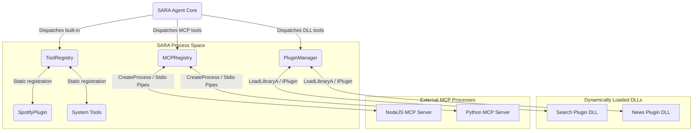
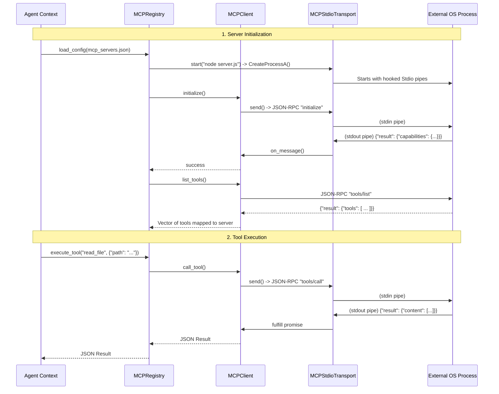

# SARA Plugin & MCP Ecosystem Architecture

The SARA agent is designed to be highly extensible. Instead of a monolithic architecture where every capability is hardcoded into the core system, SARA employs a tiered plugin architecture that allows developers to extend the agent's capabilities using native C++, dynamically loaded DLLs, or external language-agnostic processes.

This document details the three primary extensibility mechanisms:
1. **Dynamic C++ `IPlugin` DLLs**
2. **Built-in Native Plugins (e.g., Spotify)**
3. **Model Context Protocol (MCP) Integration**

---

## 1. High-Level Ecosystem Overview

The core agent accesses tools via different registries and managers. The following diagram illustrates how the three systems interact with the core agent context.

---

## 2. Dynamic C++ `IPlugin` DLL Interface

For high-performance, native tool execution, SARA supports loading external C++ DLLs at runtime. This avoids the overhead of inter-process communication while still keeping the codebase modular.

### Interface Design (`plugin_api.h`)
All DLL plugins must implement the `sara::IPlugin` abstract class. The API requires the DLL to export two C-style functions:
- `create_plugin()`: Returns a pointer to an instance of `IPlugin`.
- `destroy_plugin()`: Cleans up the plugin instance.

The `IPlugin` interface exposes:
- `get_info()`: Returns metadata (name, version, description).
- `get_tools()`: Returns a list of `PluginTool` objects, each detailing a tool's name, description, and JSON schema for its parameters.
- `execute_tool()`: The main entry point where the agent passes JSON arguments to the plugin, and the plugin returns JSON results.
- `handle_command() / on_event()`: Allows the plugin to hook into Telegram commands and asynchronous events.

### PluginManager Mechanism
The `PluginManager` is a singleton responsible for the lifecycle of these DLLs.
1. It reads configurations and loads `.dll` files via the Win32 `LoadLibraryA` function.
2. It fetches the `create_plugin` export using `GetProcAddress`.
3. It maps each exposed tool to its originating plugin via an internal `tool_to_plugin_` hash map.
4. When the agent requests a tool execution via `PluginManager::execute_tool()`, it looks up the plugin handling that tool and invokes its `execute_tool` method directly in the same memory space.

---

## 3. Built-in Native Plugins: The Spotify Example

Not all plugins are loaded as dynamic libraries. Some heavily integrated features, like the Spotify Plugin, are compiled directly into the `sara_agent` binary but follow a plugin-like organizational structure.

### Implementation Details (`spotify_plugin.cpp`)
The Spotify plugin bypasses the DLL interface and registers its capabilities directly into the core `ToolRegistry`.

1. **Initialization**: On startup, SARA calls `SpotifyPlugin::instance().start()`.
2. **Tool Registration**: The plugin injects several tools (`spotify_play`, `spotify_pause`, `spotify_seek`, etc.) into the `ToolRegistry`. It defines `ToolDef` structs containing lambda handlers that route JSON arguments to internal native C++ commands (`SpotifyCommands::dispatch`).
3. **Advanced Integration**: Because it operates natively inside SARA, it has direct access to core singletons:
   - **Telegram Integration**: It binds directly to `/sp` commands and handles callback queries for interactive inline keyboard buttons (`SpotifyDock`).
   - **State Tracking**: Uses a WebSocket background thread (`SpotifyWS`) to keep track of the current playback state and blocks certain tools (like `seek`) until a state transition occurs (e.g., waiting for a track to change before seeking).

---

## 4. Model Context Protocol (MCP) Integration

The **Model Context Protocol (MCP)** represents SARA's ultimate extensibility mechanism. It allows SARA to communicate with standard JSON-RPC 2.0 servers running in isolated, external processes (such as a Node.js filesystem server or a Python web-scraper).

### Architecture Components

1. **`MCPTransport` / `MCPStdioTransport`**: 
   - Uses the Win32 API (`CreatePipe`, `SetHandleInformation`, `CreateProcessA`) to spawn an external process.
   - Replaces the child process's standard input and standard output handles with anonymous pipes.
   - Spawns a dedicated read thread (`read_loop()`) that buffers stdout chunks, splits them by newline `\n`, and fires an `on_message_` callback for every complete JSON message.
   - Provides a non-blocking `send()` method utilizing `WriteFile` to write JSON strings to the child's stdin.

2. **`MCPClient`**:
   - Implements the JSON-RPC 2.0 logic over the transport layer.
   - Assigns a unique `id` to every outgoing request and uses a `std::promise<json>` stored in a thread-safe `std::unordered_map` to block and await the response.
   - When the `read_loop` receives a response with a matching `id`, the client fulfills the promise, waking up the calling thread.
   - Implements core MCP protocol methods: `initialize`, `notifications/initialized`, `tools/list`, and `tools/call`.

3. **`MCPRegistry`**:
   - SARA's manager for multiple MCP servers. It reads `mcp_servers.json` to dynamically spin up processes based on user configuration.
   - Extracts all tools returned by `tools/list` from each connected server and flattens them into a unified list, mapping tool names to their respective server contexts.
   - When the agent calls an MCP tool, `MCPRegistry::execute_tool()` acts as a router, dispatching the JSON payload to the correct external process.

### MCP Initialization & Execution Flow

## Summary
SARA provides a layered approach to extensibility:
- **`ToolRegistry` / Built-ins (Spotify)** for tightly-coupled, highly-interactive core features.
- **`PluginManager` / `IPlugin` DLLs** for modular, native C++ extensions loaded dynamically.
- **`MCPRegistry` / `MCPClient`** for out-of-process, cross-language tool calling following the standardized Model Context Protocol.
