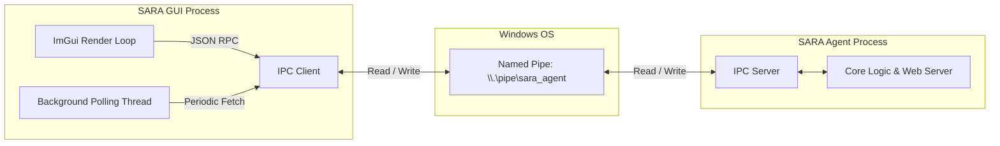
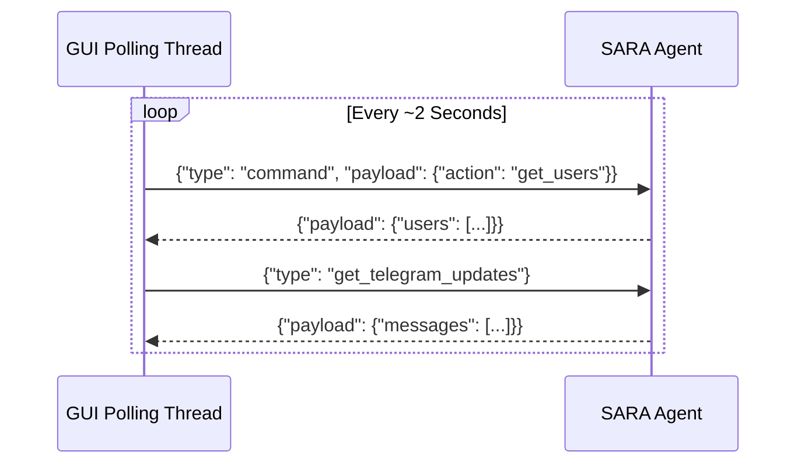

# SARA Desktop Control Panel (`sara_gui`)

## Overview

The SARA Desktop Control Panel is a graphical user interface (GUI) designed for managing, configuring, and monitoring the SARA core background agent (`sara_agent.exe`). Built with **C++** and powered by **DirectX 11** and **Dear ImGui**, the control panel provides a highly responsive, lightweight, and immediate-mode graphical experience. 

It acts as a front-end client, delegating core tasks to the background agent via **Windows Named Pipes**, utilizing **JSON** as the standard serialization format for all Inter-Process Communication (IPC).

---

## Architecture & Communication

The architecture is split between the Desktop GUI client and the background Agent server. They run as separate processes and communicate exclusively over a local Windows Named Pipe (`\\.\pipe\sara_agent`). 



### IPC Mechanism (`IPCClient`)

The `IPCClient` class abstracts the complexities of the Windows Named Pipe API:
- **Connection**: It connects to `\\.\pipe\sara_agent`. 
- **Stateless/RPC Style**: Interestingly, the implementation of `send_message` explicitly disconnects and reconnects for *every single message*. This makes the connection stateless and avoids pipe synchronization issues on concurrent writes.
- **Payload Format**: Messages are serialized to JSON using `nlohmann::json`. A standard message structure is used:
  ```json
  {
      "type": "command",
      "request_id": "16543212345",
      "payload": {
          "action": "action_name",
          "param1": "value"
      }
  }
  ```

---

## Core Implementation Details

The application logic is primarily contained within `main.cpp` and structured around the ImGui immediate-mode rendering loop.

### 1. Agent Lifecycle Management
Upon startup, the GUI searches for `sara_agent.exe` in common paths (such as the binary directory, executable directory, or a nested `build` directory). If the agent is not currently running, the GUI spawns the process using `CreateProcessA` in `CREATE_NO_WINDOW` mode and continuously attempts to attach to its named pipe.

### 2. ImGui and DirectX 11 Integration
- The application creates a Win32 window (`SARA_GUI_IMGUI`) and sets up a standard DX11 Swap Chain and Render Target View.
- Event handling occurs through the `wnd_proc` function, which delegates input to `ImGui_ImplWin32_WndProcHandler`. Window resizing dynamically invalidates and recreates the DX11 device objects to prevent stretching.
- ImGui widgets are built declaratively every frame inside the `ImGui::Begin("SARA Control Panel")` block.

### 3. Background Polling
To keep the GUI synchronized with the background agent, a dedicated polling thread (`g_poll_thread`) runs concurrently. This thread uses its own isolated `IPCClient` instance to request updates every few milliseconds:
1. **Telegram Updates**: Fetches new Telegram messages using `get_telegram_updates` and pushes them to the GUI log.
2. **Root Password**: Retrieves the dynamic setup password for new device authentications.
3. **Users List**: Queries the current list of trusted and blocked users.



---

## Features & Modules

The UI is divided into several main tabs:

### Config Tab
Manages foundational settings like the Telegram Bot Token and the session password.
- Configuration is persisted locally to a `settings.json` file.
- The user can test the Telegram API token directly from the GUI. This is cleverly implemented by invoking an asynchronous `powershell` command that makes an HTTP request to `https://api.telegram.org/bot<token>/getMe`.
- Updated configurations are sent live to the agent using the `reload_config` IPC command.

### Users Tab
Displays a table of interacting users. 
- The data is securely shared between the polling thread and the UI rendering thread via a mutex (`g_users_mtx`).
- Admins can block or unblock users. Interacting with these buttons triggers asynchronous `block_user` or `unblock_user` IPC commands, preventing UI stalls.

### LAN Dashboard Tab
Allows the user to expose a local web-based dashboard on their network.
- Activating it sends a `start_lan_dashboard` command to the agent, which responds with the local HTTP URL.
- The GUI utilizes the `qrcodegen` library to generate a QR Code encoding this URL. The QR code is rendered natively in the UI by iterating over the encoded matrix and injecting primitive rectangles (`AddRectFilled`) into ImGui's draw list (`ImGui::GetWindowDrawList()`).

### Log Tab
A simple rolling log display rendered within an `ImGui::BeginChild` scrolling region. Thread safety for logging from background tasks (like IPC tests and polling updates) is handled via a pending log buffer (`g_pending_log`) and flushed to the main string in the primary thread.
