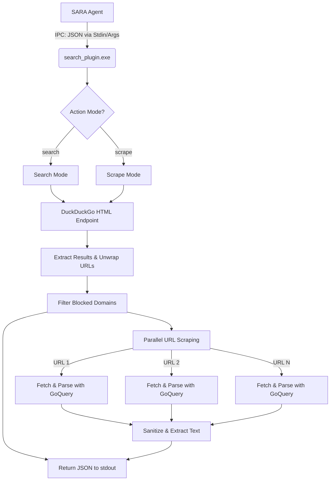
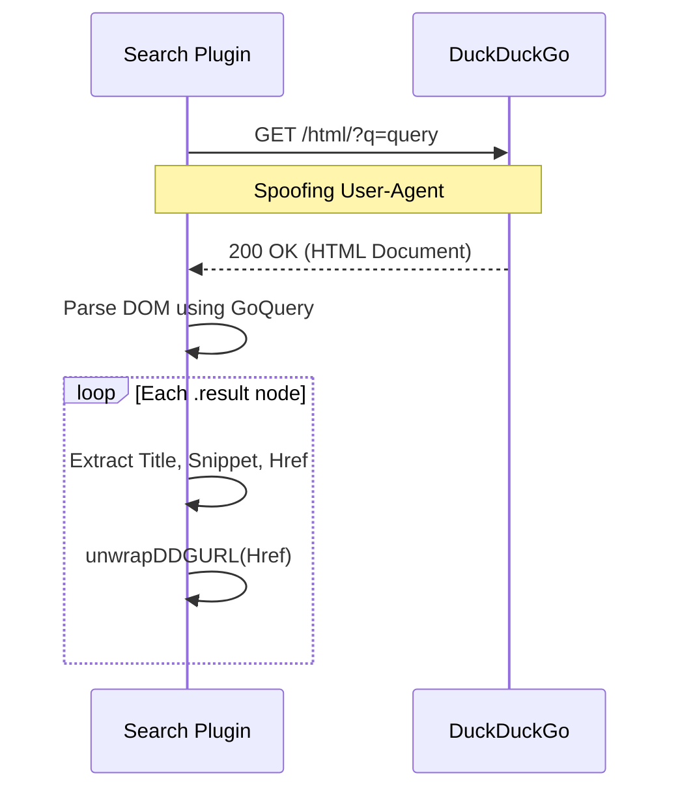

# SARA Search Plugin

## Overview
The SARA Search Plugin is a standalone Go-based executable (`search_plugin.exe`) designed to provide the SARA Agent with robust web searching and content extraction capabilities. It operates completely independently of browser automation (like Selenium or Puppeteer) by employing a lightweight crawler that interfaces directly with DuckDuckGo's HTML endpoint and scrapes target URLs concurrently.

It features two primary operational modes:
1. **Search-Only Mode:** Quickly queries DuckDuckGo and returns standard search engine result pages (titles, URLs, snippets).
2. **Search & Scrape Mode:** Performs the search, then aggressively crawls the resulting URLs in parallel to extract and summarize full-page text content, returning a synthesized "Answer" based on the extracted data.

---

## Architecture & Workflow

The plugin acts as a bridge between the SARA Agent and the Web. It uses a custom-built parallel scraping engine powered by standard `net/http` and the `GoQuery` library to efficiently parse DOM trees and extract meaningful text while aggressively filtering out noise (ads, navbars, footers).



---

## DuckDuckGo Crawler

The core search mechanism circumvents traditional APIs by scraping DuckDuckGo's lite HTML search endpoint (`https://html.duckduckgo.com/html/`).

### Implementation Details
1. **Request Construction:** A standard HTTP GET request is formed using `url.QueryEscape` on the user's query. The request spoofs a standard browser `User-Agent` to avoid anti-bot mitigation.
2. **DOM Parsing:** The response is piped into `GoQuery`. The scraper iterates over `.result` nodes.
3. **Redirection Bypass (`unwrapDDGURL`):** 
   DuckDuckGo obfuscates outbound links to track clicks, typically formatting them as `/l/?uddg=<encoded_url>`. The plugin intercepts these links, parses the `uddg` query parameter, and decodes it (`url.QueryUnescape`) to yield the pure target URL, completely bypassing DuckDuckGo's redirect server.



---

## Parallel Scraping Architecture

To provide fast context to the SARA Agent, the plugin uses Go's concurrency model (Goroutines) to scrape multiple destination URLs simultaneously. 

### Concurrency Model
The `ScrapeURLsConcurrent` function takes a slice of unwrapped URLs and spawns a goroutine for each. A `sync.WaitGroup` ensures the main execution thread waits until all pages have been fetched or timed out.
- A pre-allocated slice `results := make([]ScrapeResult, len(urls))` is used. Each goroutine writes to its respective index (`results[idx] = result`). This avoids race conditions without needing a Mutex and maintains the original relevance order of the search engine.

### Content Extraction (`scraper.go`)
Once the raw HTML of a target page is fetched, the content extraction pipeline engages:
1. **Noise Removal:** A massive CSS selector targets `<script>`, `<style>`, `<nav>`, `<footer>`, `.ad`, `#comments`, etc. `GoQuery.Remove()` instantly purges these nodes from the DOM.
2. **Heuristic Main Content Target:** The code looks for semantic tags indicating the core article: `<main>`, `<article>`, `.content`, `.post-content`.
3. **Fallback:** If semantic tags are absent or yield less than 100 characters, it falls back to parsing the entire `<body>`.
4. **Text Extraction:** Iterates over typography tags (`<p>`, `<h1>` to `<h4>`, `<li>`, `<blockquote>`) to extract text.
5. **Whitespace Normalization:** `normalizeWhitespace` squashes sequential spaces/newlines.
6. **Hard Cap:** The final string is capped at 25,000 characters to prevent memory exhaustion and token limits on the SARA Agent side.

---

## IPC Payload Format

The SARA Agent interacts with the plugin as a subprocess. Data is passed in via Standard Input (stdin) or command-line arguments, and output is captured from Standard Output (stdout).

### Request Format (Input)
```json
{
  "plugin": "search",
  "action": "scrape",
  "query": "latest golang release features",
  "scrape": true,
  "max_urls": 5
}
```
- `action` / `scrape`: Instructs the plugin whether to just return URLs or actively scrape page content.
- `max_urls`: Limits the breadth of the concurrent scrape (capped at 10 to avoid excessive resource consumption).

### Response Format (Output)
```json
{
  "success": true,
  "query": "latest golang release features",
  "sources": [
    {
      "title": "Go 1.22 Release Notes",
      "url": "https://go.dev/doc/go1.22",
      "content": "Introduction to Go 1.22. The latest Go release, version 1.22, arrives six months after Go 1.21. Most of its changes are in the implementation of the toolchain, runtime, and libraries..."
    }
  ],
  "answer": "Introduction to Go 1.22. The latest Go release..."
}
```
- `results`: Populated if operating in `Search-Only` mode.
- `sources`: Populated if operating in `Scrape` mode, containing the heavy text content.
- `answer`: A best-effort synthesized string (often the first 500 characters of the top source) for quick agent consumption.

---

## Domain Filtering

The plugin maintains an internal filter (`domains.go`) to prevent scraping non-textual or irrelevant domains.
- **Blocked Domains:** Checks URLs against an internal list (e.g., `pinterest.com`, `instagram.com`, `amazon.com`) and drops them from the queue. This list is customizable via `blocked_domains.json`.
- **Trusted Domains:** Supports an override via `trusted_domains.json` to prioritize highly relevant sites.
