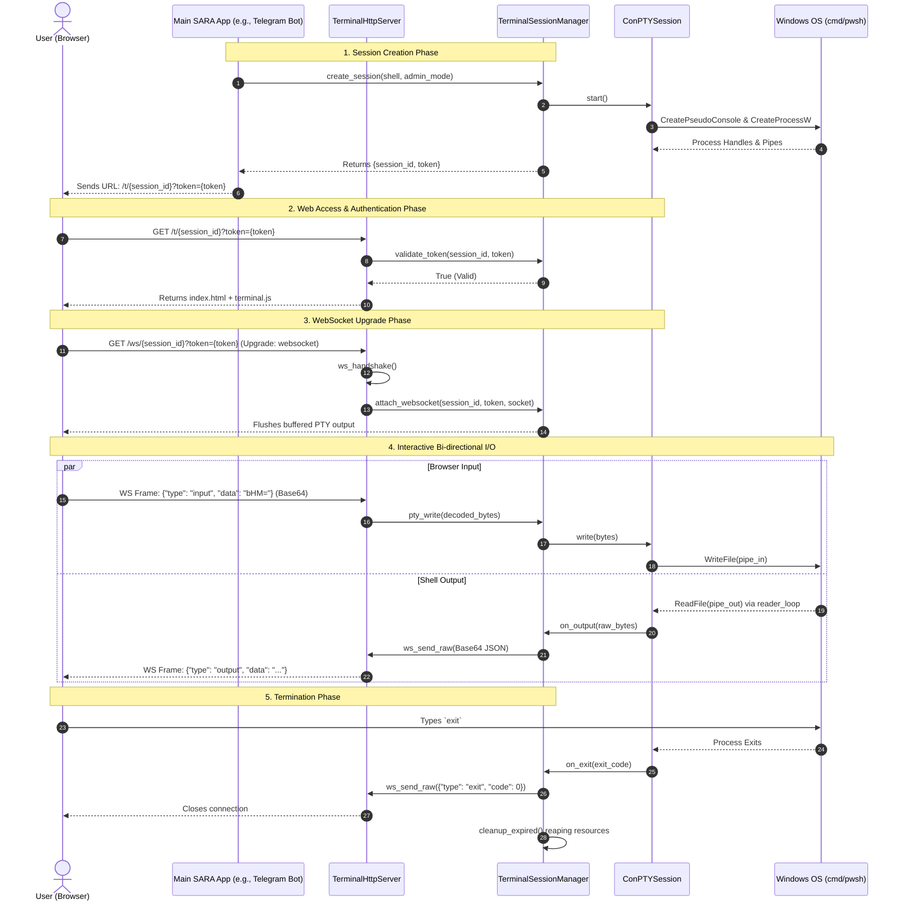

# SARA Remote Terminal Architecture

## Overview
The SARA Remote Terminal subsystem provides a full-featured, secure, web-based terminal that allows remote execution of shell commands on a Windows host. The architecture is primarily composed of an embedded HTTP/WebSocket server (`TerminalHttpServer`), a session management system (`TerminalSessionManager`), a Windows Pseudo-Console wrapper (`ConPTYSession`), and a frontend (xterm.js based) which can be accessed remotely. 

This document provides a deep dive into the four core pillars of the SARA Terminal implementation.

---

## 1. ConPTYSession: Windows Pseudo-Console Wrapper

### What it is
`ConPTYSession` is a C++ wrapper around the Windows 10 Pseudo Console (ConPTY) API (`CreatePseudoConsole`). It bridges the gap between traditional Windows command-line applications (like `cmd.exe` or `powershell.exe`) and modernized text-based streams by converting console API calls into standard VT100/ANSI escape sequences.

### How it works
For each terminal session, `ConPTYSession` launches a background shell process attached to a hidden pseudo-console window. It establishes two anonymous pipes:
- **Input Pipe (`pipe_in_write_`)**: Receives raw character bytes (keyboard inputs) from the browser and feeds them into the pseudo-console.
- **Output Pipe (`pipe_out_read_`)**: Reads VT sequences generated by the pseudo-console and bubbles them up to the WebSocket.

### Implementation Details
- **Process Creation**: In `ConPTYSession::start()`, the system initializes `STARTUPINFOEXW` and uses `UpdateProcThreadAttribute` to pass `PROC_THREAD_ATTRIBUTE_PSEUDOCONSOLE`. The child process (`CreateProcessW`) naturally inherits this pseudo-console.
- **Asynchronous Output Reader**: A dedicated background thread (`reader_loop()`) continuously calls `ReadFile` on the output pipe. Whenever data is read, it triggers an `OutputCallback` (e.g., `on_output_`), effectively pushing chunks of terminal output to the session manager.
- **Resize Tracking**: The API exposes a `resize()` function that directly calls the Windows `ResizePseudoConsole` API, allowing the frontend (xterm.js) to dynamically adjust dimensions.

---

## 2. TerminalHttpServer

### What it is
`TerminalHttpServer` is a custom, multi-threaded C++ HTTP server built directly on top of Winsock2 (`ws2_32.lib`). It acts as the gateway for all terminal traffic, serving static frontend assets, handling WebSocket upgrades, and dynamically reverse-proxying requests to auxiliary tools like FileBrowser.

### How it works
The server listens on a dedicated port (default: `9081`). Upon receiving a connection on its `accept_thread_`, it spawns detached threads that process HTTP requests synchronously or upgrade them to persistent WebSocket loops.

### Implementation Details
- **Routing Engine**:
  - `GET /t/{session_id}`: Serves the `index.html` payload for the terminal frontend but strictly validates the session token first.
  - `GET /ws/{session_id}`: Performs the HTTP 101 Switching Protocols handshake to upgrade the connection to WebSockets.
  - `GET /files/*`: Reverses-proxies requests to a local instance of `filebrowser.exe` running on port 9090.
  - `/api/new_session`: Creates new, independent terminal tabs/splits dynamically.
- **Reverse Proxy Streams**: Reverse proxy endpoints (like FileBrowser or port forwarding via `/preview/{port}/`) are achieved through raw TCP piping using `select()`. Two parallel threads copy memory bytes between the local internal socket and the external client socket.

---

## 3. WebSocket Routing

### What it is
The WebSocket routing mechanism establishes a persistent, bi-directional tunnel between the browser's `xterm.js` canvas and the `ConPTYSession` running on the backend.

### How it works
After the HTTP Upgrade phase completes, the socket is handed over to a dedicated WebSocket loop (`handle_terminal_ws`). This loop manually parses and frames WebSocket packets according to RFC 6455 without relying on heavy third-party libraries.

### Implementation Details
- **Client to Server (Input)**:
  - When the browser sends keypresses, the message arrives as a JSON payload: `{"type": "input", "data": "<base64>"}`.
  - The C++ backend extracts the string, performs base64-decoding, and dispatches the raw bytes to `TerminalSessionManager::instance().pty_write()`.
  - Resize events and heartbeat "pings" are similarly parsed and routed.
- **Server to Client (Output)**:
  - The `OutputCallback` attached to the `ConPTYSession` is invoked asynchronously whenever the Windows shell prints characters.
  - Inside the callback, the payload is base64 encoded, bundled into a JSON frame (`{"type": "output", "data": "..."}`), and immediately pushed to the socket via `ws_send_raw()`.

---

## 4. Token Authentication & Session Management

### What it is
Because the terminal grants full execution privileges on the host system, strict authentication is critical. `TerminalSessionManager` acts as the source of truth for tracking active sessions, their sockets, and securely generated cryptographic tokens.

### How it works
Tokens are generated dynamically when a session is requested (e.g., via a Telegram command) and must be presented by the browser client via Query String (`?token=`) or Cookie (`sara_token`).

### Implementation Details
- **Token Validation**: The server extracts headers and cookies using the `validate_request_token()` lambda. It verifies that the token corresponds precisely to the requested `session_id` and has not exceeded its `expires_at` timestamp.
- **Late Attachment**: Because a session is created _before_ the user opens the URL, `TerminalSessionManager` buffers up to 1MB of PTY output (`pending_output`). When `attach_websocket()` is finally called during the WS upgrade, this buffer is flushed to the frontend, preventing data loss.
- **Lifecycle Cleanup**: A background cleanup thread wakes up every 60 seconds to reap zombie/expired sessions (`cleanup_expired()`), ensuring resources (Pipes, Pseudo-consoles, and child process handles) are securely terminated.

---

## Terminal Session Lifecycle Diagram

The following Mermaid sequence diagram illustrates the lifecycle of a terminal session from creation through interaction to termination.

