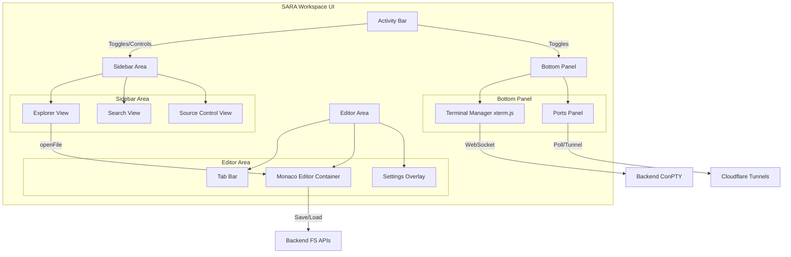
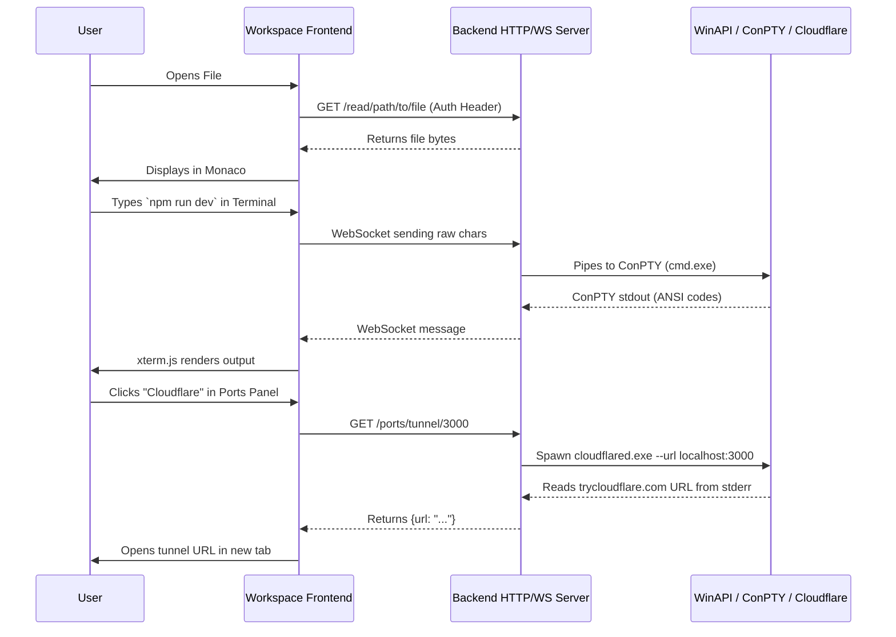

# SARA Workspace Architecture

The SARA Workspace is a comprehensive, browser-based IDE clone (resembling VS Code) built to interface with the SARA C++ backend. It provides an immersive development environment, bridging local system capabilities with remote accessibility.

## 1. UI Layout & Component Overview

The Workspace interface is built using pure HTML, CSS, and modular vanilla JavaScript (ES6 modules). It consists of four main layout areas:

### 2. Deep Dive into Core Components

#### 2.1 Activity Bar
Located on the far left, the Activity Bar serves as the primary navigation hub. 
- **Icons & Menus:** It contains icons for Explorer, Search, Git, Terminal, Ports, Settings, and a Help menu. 
- **File Menu:** The top "File" icon acts as a dropdown menu for workspace-level actions (New File, New Folder, Open Folder, Save, Auto Save toggle).
- **Implementation:** Governed by `main.js`, clicking an icon toggles the visibility of the corresponding Sidebar view or Bottom Panel, manipulating DOM classes and styles dynamically while highlighting the active state.

#### 2.2 Explorer (`explorer.js`)
The File Explorer provides a tree-view representation of the workspace file system.
- **Data Flow:** Uses recursive `apiFetch('/tree${path}')` calls to the backend to retrieve directory contents.
- **Rendering:** Generates DOM nodes for files and directories dynamically. Directories can be expanded/collapsed.
- **File Operations:** Right-clicking reveals a custom context menu (cut, copy, paste, rename, delete, copy path) injected into the DOM. Double-clicking a file triggers `openFile()` in `editor.js`.
- **Icons:** Uses an `IconRegistry` (`icons.js`) to display specific SVG icons based on file extensions.

#### 2.3 Monaco Editor (`editor.js`)
The core text editing experience is powered by Microsoft's Monaco Editor (the same engine behind VS Code).
- **Initialization:** Loaded asynchronously via AMD (`require`) to prevent conflicts with other modules.
- **State Management:** Editor tabs are maintained in a state array (`state.openTabs`). The workspace supports tracking "dirty" (unsaved) files and will visually indicate unsaved changes.
- **Features:** 
  - **Auto-Save:** When enabled, a debounced timer triggers `saveCurrentFile()` after 1000ms of inactivity.
  - **Live Server Integration:** Custom Monaco Actions are registered (accessible via F1 or right-click context menu) to spawn a local Live Server (`/live_server/start`) for HTML files.
- **Settings Overlay:** Settings are presented as an interactive UI overlay within the editor space, allowing real-time modification of workspace appearance, layout, and editor behaviors (font size, word wrap, minimap, etc.).

#### 2.4 Terminal Panel (`terminal.js`)
A full-fledged, multi-tab terminal emulator integrated into a resizable bottom panel.
- **xterm.js Integration:** Uses `xterm.js` along with `xterm-addon-fit` (for responsive resizing) and `xterm-addon-web-links` (for clickable URLs).
- **Session Management:** Users can spawn multiple terminal instances (e.g., `PS1`, `PS2`). Each instance creates a backend `ConPTYSession` via API and establishes a binary WebSocket connection to stream raw console I/O seamlessly.
- **Smart Link Handling:** If a user clicks a `localhost` URL inside the terminal, the `WebLinksAddon` intercepts it and automatically triggers the Cloudflare tunnel API to expose that port securely.

#### 2.5 Ports Panel (`ports.js`)
A network management interface for development servers running within the workspace.
- **Polling:** When the panel is active, it polls the `/ports` backend endpoint every 3 seconds to detect active TCP listeners on the host.
- **Tunneling Integration:** The table displays active ports and offers two action buttons:
  - **Local LAN:** Opens the port on the host's local network IP.
  - **Cloudflare:** Synchronously invokes `apiFetch('/ports/tunnel/${port.port}')`. The backend provisions a `cloudflared` child process for that port and returns a public `.trycloudflare.com` URL, seamlessly bypassing NAT and firewall restrictions directly from the browser.

## 3. Communication Architecture

The frontend relies heavily on a centralized `api.js` wrapper which manages Authentication Tokens and standardizes HTTP calls.

## Summary
The SARA Workspace frontend provides a completely decoupled, zero-installation IDE experience. By heavily relying on ES6 modules and a state singleton (`state.js`), the application maintains low overhead. The seamless integration between the Monaco Editor, xterm.js, and the custom backend C++ APIs allows developers to write code, manage the filesystem, and securely expose local servers to the internet without ever leaving the browser.
